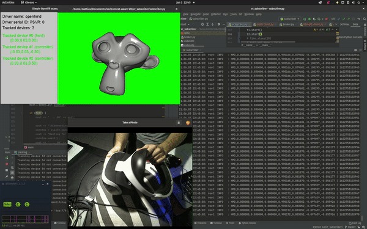

# CAVR: Context-Aware-VR 

# INFO

CONTEXT:

- Rotation of the head

- Location of the user (talk to Ken about the indoor positioning system if needed)

- Where is the user looking (eye capture)

- Mobility pattern (secondary context info, can be derived from the locations of the user)

 

SYSTEM:

- VR headset + toolchain for sampling and visualization of data

- Definition of the interface for data collection (method, data types, implementation tools, etc.)

 

ToDo:

- Small survey of the existing VR headsets and their features

- Selection of two relevant VR headsets

- Development of the toolchain for one VR headset

- Demonstration of the integration of the toolchain for the other VR headset

 

- Important I: selection of the appropriate methods for data extraction (rest, pub/sub, single-writer log, etc), data definitions, and implementation tools

- Important II: data should be extracted from the heaadset and visualised in the real-time. The visualization tool should be able to define the relevant data parameters, for example the reporting frequency. The specification of the relevant data paramaters is envisioned as one part of the project (I expect only the reporting frequency to be relevant, but let’s see).

 

EVALUATION:

- Scalability (how much data can the system handle)

- Real-timeliness (delay in data reporting and visualization)

 

REPORTING:

- Technical report (6-8 pages, IEEE double column) – the mentioned small survey will be one part of the report, please take that into account

- Demo paper submitted to a conference (with our full support)

- Two presentations: i) current status, ii) final presentation

 

STARTING TIME:

- Starting now slowly (literature review)

- September - starting with implementation efforts

- Report has to be submitted two weeks before the exam period (hard deadline)

- Part of the internship can/should (COVID-depending) be done in the Beacon
